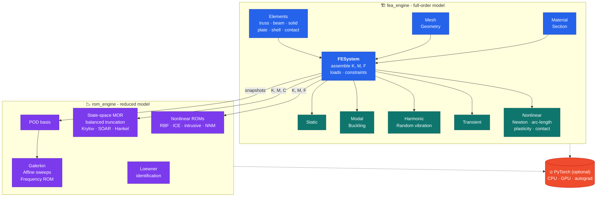
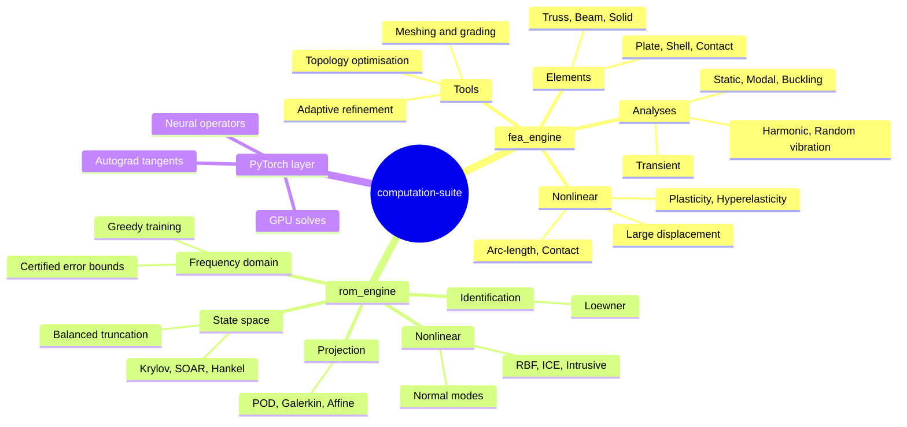
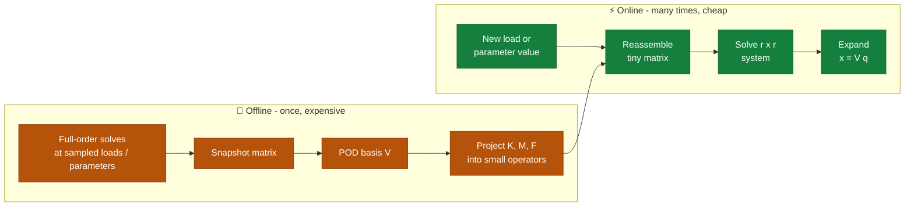
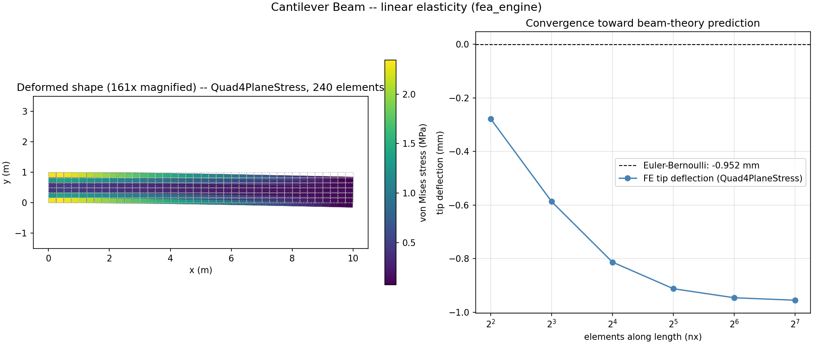
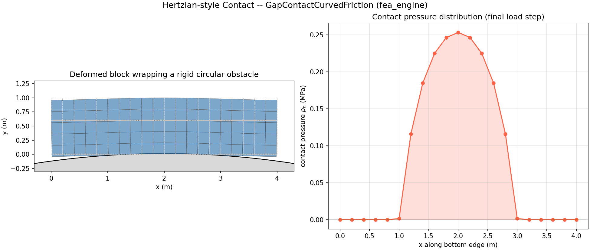
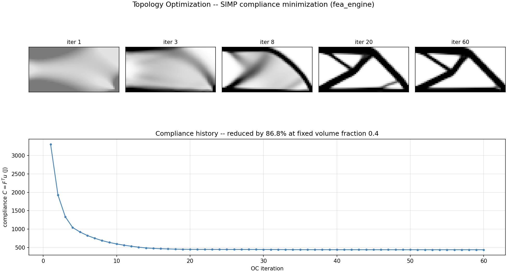
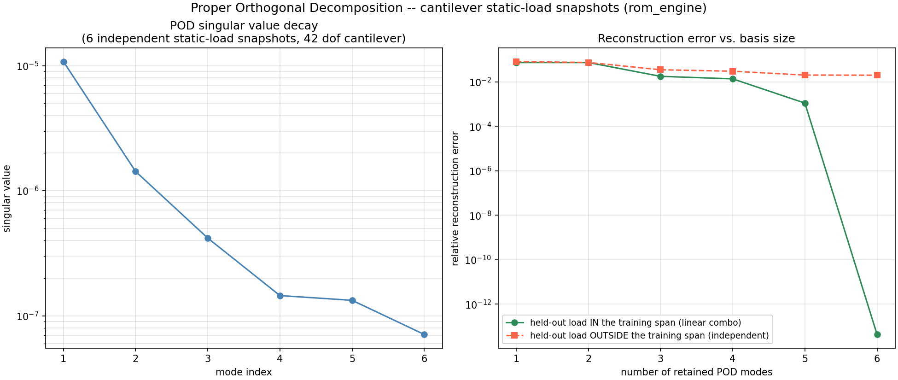
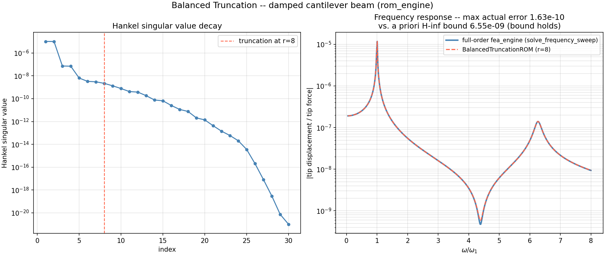
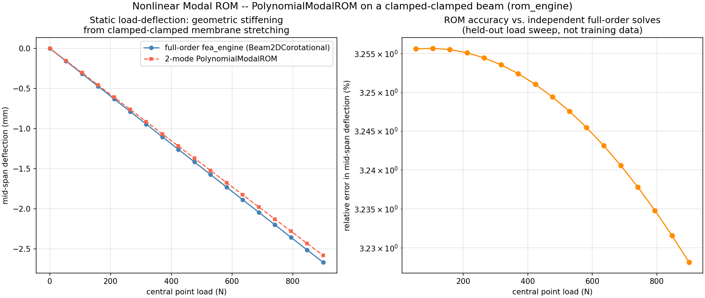

<div align="center">

# computation-suite

**From-scratch finite element analysis and reduced-order modeling in Python**


[**🔗 github.com/abhi2k16/fea-rom-computation-suite**](https://github.com/abhi2k16/fea-rom-computation-suite) &nbsp;|&nbsp; [⬇️ Clone](#s-2) &nbsp;|&nbsp; [🚀 Quick start](#s-3)

</div>

## 🧭 Contents

| | |
|---|---|
| 📦 [Packages](#s-1) | 📚 [Documentation](#s-7) |
| ⚙️ [Install](#s-2) | 🗂️ [Repository layout](#s-8) |
| 🚀 [Quick start](#s-3) | ✅ [Tests](#s-9) |
| 🔄 [A typical workflow](#s-4) | ⚠️ [Notes and limits](#s-10) |
| 🖥️ [CPU, multi-core and GPU](#s-5) | 📄 [License](#s-11) |
| 🧪 [Examples](#s-6) | 🎨 [At a glance](#glance) |

---


A from-scratch, NumPy/SciPy-native finite element and reduced-order modeling
toolkit for structural mechanics, with an optional PyTorch layer for GPU
acceleration and automatic differentiation.

Every result is checked against an independent reference: a closed-form
solution, a second numerical method, or a conservation law. Nothing here is
a wrapper around a commercial solver.

<a id="glance"></a>

## 🎨 At a glance

### How the pieces fit together



### What is inside



### Why reduce a model: offline once, online many times



Measured on the two-region beam example in `USER_GUIDE.md` (120 elements, 500-point parameter sweep, relative error about 1.5e-3):

```text
Full-order   1653.23 ms  ██████████████████████████████████████████████████████████████████████
Reduced-order   7.45 ms  ▏                                                         221.8x faster
```

### Results from the example gallery

<table>
<tr>
<td align="center"><a href="fea_engine/examples/gallery/fea_01_cantilever_beam.py"></a><br><sub><b>Cantilever</b>: von Mises stress and mesh convergence to the beam-theory value</sub></td>
<td align="center"><a href="fea_engine/examples/gallery/fea_03_hertzian_contact.py"></a><br><sub><b>Contact</b>: block pressed onto a rigid obstacle</sub></td>
<td align="center"><a href="fea_engine/examples/gallery/fea_06_topology_optimization.py"></a><br><sub><b>Topology optimisation</b>: 86.8 % less compliance at fixed volume</sub></td>
</tr>
<tr>
<td align="center"><a href="rom_engine/examples/gallery/rom_01_pod_basis.py"></a><br><sub><b>POD basis</b>: singular-value decay and reconstruction error</sub></td>
<td align="center"><a href="rom_engine/examples/gallery/rom_04_balanced_truncation.py"></a><br><sub><b>Balanced truncation</b>: actual error stays below the certified bound</sub></td>
<td align="center"><a href="rom_engine/examples/gallery/rom_05_nonlinear_modal_rom.py"></a><br><sub><b>Nonlinear modal ROM</b>: 2 modes vs 51-DOF full-order beam, max error 3.3 %</sub></td>
</tr>
</table>

Click an image to open the script that produced it. All twelve gallery figures are in `fea_engine/examples/gallery/` and `rom_engine/examples/gallery/`.

<a id="s-1"></a>

## 📦 Packages

| Package | Purpose |
|---|---|
| [`fea_engine`](fea_engine/README.md) | Full-order finite element package: static, dynamic and geometrically nonlinear analysis, with extensible materials, elements, loads and solvers. |
| [`rom_engine`](rom_engine/README.md) | Reduced-order modeling built on top of `fea_engine`. |

The two work together: build K, M and F with `fea_engine`, then hand those
plain arrays to `rom_engine`. `rom_engine` needs nothing from `fea_engine` at
run time (the `fea` extra only installs it for the examples and tests).

### What `fea_engine` covers

- **Elements:** trusses (linear, large-displacement, plastic); 2-D and 3-D beams (Euler-Bernoulli, corotational, geometrically exact Reissner); plane stress/strain triangles and quadrilaterals (linear and quadratic); 3-D solids (hexahedra and tetrahedra, linear and quadratic, B-bar); Mindlin plates; MITC shells (linear, corotational, director-based); contact elements (gap, node-to-segment, with friction).
- **Analyses:** static, linear buckling, modal, harmonic / frequency sweep, random vibration (PSD), implicit and explicit transient, nonlinear static with load stepping, displacement control, arc-length and Koiter-Newton, nonlinear transient (Newmark-Newton).
- **Nonlinearity:** large displacement and rotation, J2 plasticity (isotropic and kinematic hardening), Neo-Hookean hyperelasticity, penalty and Lagrange-multiplier contact.
- **Mesh and loads:** structured mesh generators (lines, rectangles, boxes, with holes and notches), graded meshes, multi-block meshes, mesh file I/O (`meshio`), edge and face pressure loads by quadrature, adaptive refinement with error estimators.
- **Performance and GPU:** vectorised assembly, sparse and iterative solvers (CG with Jacobi/SSOR preconditioning), batched multi-load solves, torch CPU/GPU solve backends, autograd tangents, topology optimisation.

### What `rom_engine` covers

- **Projection ROMs:** POD basis (optionally mass-weighted) and Galerkin reduction for static, modal and transient problems; affine parametric decomposition for fast parameter sweeps.
- **Frequency-domain ROMs:** modal/POD/greedy bases, frequency response, random-vibration response, and certified error bounds (SCM).
- **Systems-and-control reduction:** balanced truncation (plain and frequency-weighted), singular perturbation, optimal Hankel-norm approximation, Krylov and second-order (SOAR) moment matching, passivity checks.
- **Non-intrusive identification:** Loewner-pencil modal identification with cross-ROM stability screening.
- **Nonlinear structural ROMs:** RBF-surrogate and polynomial (ICE-style) models, intrusive projection of nonlinear internal forces, membrane expansion, nonlinear normal mode backbone curves.
- **Training tools:** optimal Latin hypercube sampling, dataset coverage diagnostics, comparison metrics.
- **Research-grade (PyTorch):** neural operators, parameterised latent ODEs, reduced-basis operators, differentiable correction, ensemble uncertainty. Treat these as prototypes.

<a id="s-2"></a>

## ⚙️ Install

**Repository:** <https://github.com/abhi2k16/fea-rom-computation-suite>

### Clone the repository

Requires [Git](https://git-scm.com/downloads) and Python 3.9 or newer.

```bash
git clone https://github.com/abhi2k16/fea-rom-computation-suite.git
cd fea-rom-computation-suite
```

Using SSH instead (if you have a key set up with GitHub):

```bash
git clone git@github.com:abhi2k16/fea-rom-computation-suite.git
```

Create an isolated environment (recommended), then install both packages in editable mode so changes to the source take effect immediately:

```bash
# Linux / macOS
python -m venv .venv
source .venv/bin/activate

# Windows PowerShell
python -m venv .venv
.venv\Scripts\Activate.ps1
```

If PowerShell refuses to run the activation script, run `Set-ExecutionPolicy -Scope CurrentUser RemoteSigned` once, or use Anaconda: `conda create -n fea-rom python=3.11` then `conda activate fea-rom`.

To update an existing clone later: `git pull` from the repository folder.

### Install the packages

```
pip install -e fea_engine
pip install -e rom_engine
```

With the optional extras (plotting, tests, and the `fea` link for the ROM examples):

```
pip install -e "fea_engine[plot,dev]"
pip install -e "rom_engine[fea,dev]"
```

Python 3.9 or newer. Required: NumPy 1.22+ and SciPy 1.8+.

Check the install:

```
python -c "import fea_engine, rom_engine; print(fea_engine.__version__, rom_engine.__version__)"
```

**Optional dependencies**

| Need | Install |
|---|---|
| Plotting | `matplotlib` (the `plot` extra of `fea_engine`) |
| Mesh file I/O | `pip install meshio` |
| PyTorch, CPU only | `pip install torch --index-url https://download.pytorch.org/whl/cpu` |
| PyTorch, NVIDIA GPU | `pip install torch --index-url https://download.pytorch.org/whl/cu126` (match the `cuXXX` to your driver) |

There is no generic `[torch]` extra on purpose, because the right wheel depends
on your hardware. A plain `import fea_engine` or `import rom_engine` never
needs torch or matplotlib. See `USER_GUIDE.md` for known torch problems
(Pascal GPUs, the OpenMP error on Windows with Anaconda).

<a id="s-3"></a>

## 🚀 Quick start

A 0.4 x 0.2 m steel plate, clamped on the left and loaded on the right:

```python
import numpy as np
from fea_engine import Material, D_plane_stress, Quad4PlaneStress, FESystem
from fea_engine.mesh import rectangle_mesh

mat = Material(E=2.1e11, nu=0.3, rho=7850.0)
mesh = rectangle_mesh(Lx=0.4, Ly=0.2, nx=24, ny=12)
sys = FESystem(mesh, Quad4PlaneStress(), thickness=0.02)
sys.assemble_stiffness(D_plane_stress(mat), thickness=0.02)

tip = mesh.nodes_on_line(axis=0, value=0.4)
sys.add_nodal_force(tip, dof_index=1, total_force=-20000.0)
sys.fix_dofs(mesh.nodes_on_line(axis=0, value=0.0), [0, 1])

U = sys.solve_static()          # mean tip deflection about -1.797e-4 m
```

Every `fea_engine` problem has the same shape: **material, mesh, element,
`FESystem`, then assemble, apply loads and constraints, solve.** Swap the
element or the `solve_*` call and the rest stays the same.

Then reduce it:

```python
from rom_engine import PodBasis, GalerkinROM

sys.assemble_mass(mat.rho * np.eye(2))
# snaps: columns are full-order solutions at several load levels
basis = PodBasis().fit(snaps, n_modes=6, M=sys.M)
rom = GalerkinROM(basis).reduce_system(sys.K, M=sys.M, F=sys.F)
x_full, q = rom.solve_static()  # 650 unknowns reduced to 6
```

`API_REFERENCE.md` has the complete runnable versions (including how to build
`snaps`), natural frequencies, a nonlinear beam, affine sweeps, frequency
response and balanced truncation, each with the output it printed.

<a id="s-4"></a>

## 🔄 A typical workflow

1. **Full-order model (`fea_engine`):** mesh, material, element, loads, constraints, solve. Check one result against a hand calculation or analytic solution.
2. **Snapshots:** solve at a handful of load levels or parameter values (`solve_batched` reuses one factorisation for many loads).
3. **Reduce (`rom_engine`):** POD basis, then Galerkin projection. For parameter sweeps add `AffineDecomposition`; for dynamics try modal or frequency-domain ROMs.
4. **Verify:** compare the reduced answer with a full-order solve at points not used for training. The packages report energy captured, residuals and, for some methods, certified error bounds.
5. **Use online:** run the small reduced model thousands of times for design sweeps, optimisation or uncertainty studies.

<a id="s-5"></a>

## 🖥️ CPU, multi-core and GPU

```python
sys = FESystem(mesh, elem, thickness=0.02, backend="torch", device="cuda")   # GPU solve
```

SciPy is the default and torch/CUDA are opt-in. Neither package schedules its
own threads; multi-core use comes from the BLAS library NumPy links against.

- **CPU threads:** set `OMP_NUM_THREADS`, `OPENBLAS_NUM_THREADS` and `MKL_NUM_THREADS` before NumPy is imported.
- **`run.py`:** runs any script with a chosen core count without editing it (see the docstring at the top of `run.py`).
- **GPU:** only pays off for large sparse systems; small models are usually faster on the CPU. `backend="auto"` chooses for you above 5000 free DOF.
- **Sweeps:** the frequency/amplitude sweeps in `rom_engine.attractor` accept `n_jobs=` for multi-process execution.

Details, measured examples and a "when does a GPU help" table are in the
"Multi-core, CPU and GPU (PyTorch) usage" section of `USER_GUIDE.md`.

<a id="s-6"></a>

## 🧪 Examples

| Where | What |
|---|---|
| `fea_engine/examples/main.py` | Eight problems run end to end against closed-form references. |
| `fea_engine/examples/gallery/` | Cantilever beam, hyperelasticity, Hertzian contact, plasticity, modal analysis, topology optimisation (with a README). |
| `fea_engine/examples/` | Buckling, arc-length snap-through, 3-D frames, shells, higher-order elements, sparse vs dense timing, SciPy vs torch benchmark. |
| `rom_engine/examples/gallery/` | POD basis, parametric Galerkin ROM, greedy frequency training, balanced truncation, nonlinear modal ROM, dataset diagnostics (with a README). |
| `rom_engine/examples/` | Two-region beam affine sweep, frequency sweep, certified bounds, mode-shape recovery, plate modal identification. |

Run an example from its package folder, for instance
`cd fea_engine && python examples/main.py`.

<a id="s-7"></a>

## 📚 Documentation

| File | Contents |
|---|---|
| [USER_GUIDE.md](USER_GUIDE.md) | Getting started, concepts, a tour of every capability with worked examples, multi-core and GPU usage, performance numbers. |
| [API_REFERENCE.md](API_REFERENCE.md) | Every public class, function and method with signature and purpose, a task-to-API map, and eight executed examples. |
| `fea_engine/README.md`, `rom_engine/README.md` | Full module references and validation records. |
| `fea_engine/docs/` | Roadmaps and implementation notes (nonlinear FEM, shells, mesh grading, meshing alternatives, TensorMesh analysis). |
| `rom_engine/docs/` | Roadmaps and design notes (classical MOR, frequency-domain ROM, error bounds and greedy training, Loewner identification, nonlinear surrogate ROMs, differentiable correction, testing methodology). |
| `fea_engine_Technical_Notes.*`, `rom_engine_Technical_Notes.*` | Technical notes (Word and PDF). |
| `fea_engine_rom_engine_coupling.html` | How the two packages couple and the torch-optional pattern. |
| `hpc_translation_roadmap.html` | Plan for porting the numerical core to HPC. |
| `module_review_*.md` | Review notes. |

<a id="s-8"></a>

## 🗂️ Repository layout

```text
computation-suite/
  fea_engine/            finite element package   (src/, tests/, examples/, docs/)
  rom_engine/            reduced-order modeling   (src/, tests/, examples/, docs/)
  run.py                 run any script with a chosen number of CPU cores
  USER_GUIDE.md
  API_REFERENCE.md
  module_review_*.md
  *_Technical_Notes.*
```

Both packages use the standard `src/` layout and are pip-installable.

<a id="s-9"></a>

## ✅ Tests

```
cd fea_engine  && pytest tests/ -q
cd rom_engine  && pytest tests/ -q
```

Tests that need PyTorch skip themselves when it is not installed. The test
suites compare against analytic solutions, independent implementations and
theorems (for example passivity and certified bounds); `rom_engine/docs/testing_methodology.md`
describes the approach.

<a id="s-10"></a>

## ⚠️ Notes and limits

- **Units:** the packages are unit-agnostic. Use one consistent system, such as SI.
- **Reduced results:** always compare a reduced result with at least one full-order solve before relying on it.
- **Torch coverage is selective:** `backend="torch"` currently affects `solve_static()` and a few named routines; modal, buckling and the explicit transient drivers stay SciPy/NumPy-only.
- **Research-grade modules** in `rom_engine` (neural operator, latent ODE, reduced-basis operator, ensemble UQ, differentiable correction) are prototypes.
- **Gmsh:** Gmsh-based geometry support has been removed; use the structured mesh generators, `meshio`, or mesh files from external tools.

<a id="s-11"></a>

## 📄 License

Both packages declare the MIT license in their `pyproject.toml`. There is no
`LICENSE` file in this folder yet; add one before publishing.
